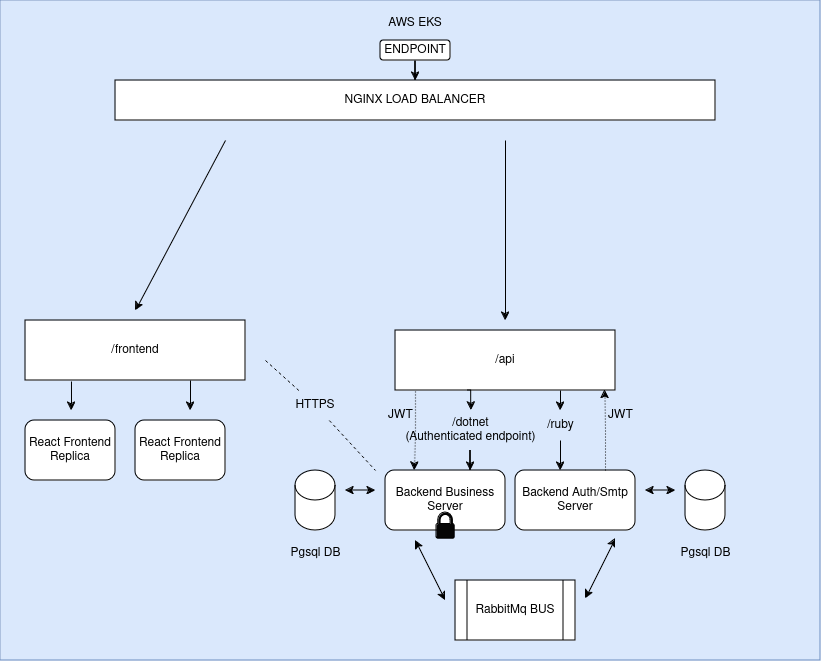

The main idea is creating an app using a microsservices architeture where one service would be responsible
for the user authentication and the other for the resources/ email sending services.

The Rails is responsible for providing the user the authentication tokens, user creation and registration wich are
transactionally cloned to the dotnet service where the business logic and associations are implemented.

the JWT token is
decoded in the dotnet app the same way it would in the rails application and the service also keeps track of the
blacklisted tokens.

The async communication between the app is made through RabbitMQ , and CQRS and DDD where the main patterns
praticed. The app was dockerized and deployed to AWS EKS, with some annotations on how to do it using AWS load-balancer
in the AWS-UTILS.txt file.



App usage
---

- User Creation, registration and token Blacklisting must be made through rails API.

- JWT token is aquired through endpoint (railservice)/auth/login.

- Login and Registration payload examples :

```json
{
  "user": {
    "email": "mail@mail.com",
    "password": "password"
  }
}
```

- JWT token is required in the header of all requests to both the APIs.

```json
{
  "Authorization": "Bearer {token}"
}
```

- ENDPOINTS :
  **Rails**
    - `**POST** /auth/login`
    - `**POST** /auth/register`
    - `**DELETE** /auth/logout`
    - `**GET** /auth/current_user`
- **DOTNET** :
    - `**RESOURCES** /api/Bands`
    - `**RESOURCES** /api/People`
    - `**GET** /confirm/{token} Confirm user account`


